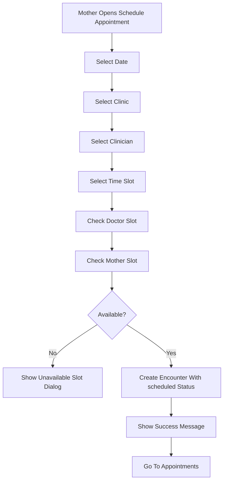

# Appointments And Records

## Current Status

Appointments and records are confirmed features. The app uses `encounters` as both appointment rows and completed clinical encounter result rows.

## Appointment Features

Confirmed:

- Appointment list screen: `EncountersWidget`.
- Appointment detail screen: `AppointmentDetailsWidget`.
- Booking bottom sheet: `BookingBottomSheetWidget`.
- Completed encounter result page: `EncounterDetailsWidget`.
- Appointment statuses include `scheduled`, `completed`, and `canceled`.
- Cancelled appointments are filtered out of the appointment list.
- Scheduled appointments can be cancelled.
- Completed appointments can open encounter result details.

## Booking Flow

## Appointment Data Fields

Confirmed `encounters` fields include:

- `mother_id`
- `doctor_id`
- `clinic_id`
- `appointment_date`
- `appointment_time`
- `status`
- `is_instant`
- Clinical result fields such as `bp`, `pulse`, `next_visit`, `comment`, urine/lab fields, fetal fields, and other encounter measurements.

## Records Features

Confirmed:

- Mother profile records in `mothers`.
- First encounter records in `first_encounters`.
- Parity history in `parities`.
- Appointment/clinical visit records in `encounters`.
- Period tracker records in `period_tracker_settings` and `period_tracker_entries`.
- Rudo chat records in `chat_sessions` and `chat_messages`.

## Saved Health Results

Confirmed:

- Completed encounter results can be displayed from `encounters`.
- Blood pressure, pulse, blood level, urine indicators, fetal heartbeat, baby size, next visit, and comments are represented in `EncounterRecord`.

Needs confirmation:

- Whether the Dawa Mom app itself writes completed clinical results.
- Whether Dawa Clinician or another clinician-facing app writes clinical encounter fields.
- Whether mothers can export or download records.

## Backend And Local Storage

Backend:

- Appointment and record rows are stored in Supabase.
- RLS restricts access based on patient ownership, doctor assignment, and admin role.
- Duplicate slot indexes reduce appointment conflicts.

Local:

- `FFAppState().motherRef` persists the active mother reference.
- No complete local offline appointment cache was confirmed.

## Known Gaps

- The app relies heavily on `FFAppState().motherRef`; this should be resolved from the logged-in profile after auth/session changes.
- No reminder/notification workflow was found.
- No test coverage exists for appointment booking/cancellation.
- No separate audit log was found for appointment changes.
- No explicit appointment reschedule flow was found.
