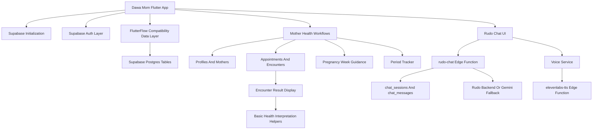

# Architecture

Dawa Mom is a Flutter application with Supabase as the active app backend. The code still contains FlutterFlow/Firestore-style generated names, but the active runtime paths use Supabase Auth, Supabase Postgres, and Supabase Edge Functions.

The current cross-project boundary, identifier mapping, outbox workers and rollout state are documented in [Dawa Platform Integration](dawa-platform-integration.md).

## High-Level Architecture

## Frontend Layer

The frontend is Flutter/Dart. It uses FlutterFlow-generated patterns for screens, models, theme, navigation, and record classes. Important frontend areas include:

- `lib/main.dart` for app initialization and navigation.
- `lib/auth/` for login, registration, profile completion, and password reset.
- `lib/navbar/` for home, appointments, profile, pregnancy week, and period tracker screens.
- `lib/components/` for reusable bottom sheets, appointment cards, and empty/loading states.
- `lib/flutter_flow/` for shared theme, widgets, utility functions, and generated navigation.

## Auth Layer

The active auth layer is Supabase:

- `initSupabase()` runs before app state/theme initialization.
- Auth state is exposed through `dawaMomSupabaseUserStream()`.
- JWT state is exposed through `jwtTokenStream`.
- `SupabaseAuthManager` handles email sign-in, signup, reset password, OAuth scaffolding, phone OTP scaffolding, anonymous sign-in, and sign-out.
- Invalid Supabase password login can fall back to `firebase-auth-migrate-login` for first-login legacy Firebase password migration.

## Supabase Backend Layer

Supabase handles:

- Auth users and profile mirror rows.
- PostgreSQL data tables.
- Row Level Security policies.
- Triggers for updated timestamps, auth profile creation, profile role protection, and patient clinical-write prevention.
- Edge Functions for Rudo chat, Gemini proxy, ElevenLabs TTS, and Firebase password migration.

## Firebase Legacy Layer

Firebase is not active in the Flutter app packages or platform Gradle configuration. The repo still has intentional legacy names and migration structures:

- FlutterFlow-generated schema classes still use Firestore-style helper names.
- `lib/backend/supabase/supabase_database.dart` maps those names to Supabase tables.
- SQL migrations include `firebase_ref`, `legacy_firebase_refs`, `legacy_payload`, `legacy_orphan_records`, and Firebase auth migration tables.
- The auth manager has a Firebase password migration fallback.

## Health Feature Layer

Health workflows are split across records and screens:

- Mother profile data in `mothers`.
- First encounter maternal history in `first_encounters`.
- Parity history in `parities`.
- Appointment and clinical visit results in `encounters`.
- Pregnancy education content in `pregnancy_weeks`.
- Period/cycle entries in `period_tracker_settings` and `period_tracker_entries`.

## Blood Pressure Layer

Blood pressure is currently confirmed as part of completed encounter results:

- `encounters.bp` stores a text value such as `120/80`.
- `EncounterRecord.bp` exposes the field to Flutter.
- `bloodPressureConversion()` classifies the string into labels like `Normal`, `Moderately High`, `Severely High`, `Low`, or `Invalid Input`.
- `EncounterDetailsWidget` displays the result.

Needs confirmation: I did not find a standalone mother-facing blood pressure monitor screen or persistent BP result table separate from encounters.

## Local And Offline Layer

The app is light-mode only. `SharedPreferences` remains available for local app state such as onboarding completion; runtime theme selection is not persisted. Supabase session persistence is handled by `supabase_flutter`.

Supabase session persistence is handled by `supabase_flutter`. There is no confirmed offline queue, conflict resolution layer, or local database sync implementation. `sqflite` is listed in `pubspec.yaml`, but I did not find a confirmed active offline sync feature using it.

## UI And Design Layer

The UI uses:

- FlutterFlow theme tokens in `lib/flutter_flow/flutter_flow_theme.dart`.
- Poppins fonts from `assets/fonts/`.
- Material icons and FlutterFlow widgets.
- App images and illustrations under `assets/images/`.
- Responsive phone navigation and bounded tablet/desktop navigation for Home, Appointments, Period Tracker and Settings.
- A floating Rudo assistant action on the Home screen.

## External Services

| Service | Confirmed Use |
|---|---|
| Supabase Auth | App authentication and session management. |
| Supabase Postgres | Main app database. |
| Supabase Edge Functions | Rudo chat, Gemini proxy, ElevenLabs TTS, Firebase password migration. |
| Gemini | Used behind Edge Function/backend paths, not directly from the Flutter client. |
| ElevenLabs | TTS through `elevenlabs-tts`, with API key stored as Supabase secret. |
| Existing Rudo backend | `rudo-chat` can call a backend URL, with a default Rudo production URL in the function. |
| WhatsApp backend | Python backend files include WhatsApp webhook and messaging logic. This appears backend/Rudo-related, not direct Flutter UI. |
