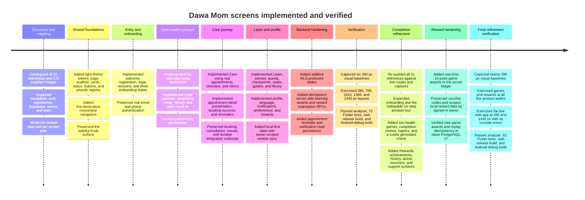

# Dawa Mom redesign implementation order

```mermaid
timeline
    title Dawa Mom screens implemented and verified
    Discovery and mapping
        : Catalogued all 31 references and 174 supplied images
        : Inspected navigation, auth, repositories, Supabase, assets, and tests
        : Wrote the screen map and per-screen plan
    Shared foundations
        : Added light-theme tokens, page scaffold, cards, status, buttons, and artwork registry
        : Added five-destination responsive navigation
        : Preserved the stateful Rudo surface
    Entry and onboarding
        : Implemented welcome, registration, login, recovery, and three onboarding states
        : Preserved real email and phone authentication
    Core health surfaces
        : Implemented the real-data home dashboard
        : Implemented cycle calendar, pregnancy mode, history, and daily check-in
        : Verified period-entry persistence
    Care journey
        : Implemented Care using real appointments, clinicians, and clinics
        : Implemented appointment detail presentation, booking success, and reminders
        : Preserved booking, cancellation, results, and durable integration outboxes
    Learn and profile
        : Implemented Learn, articles, quests, checkpoints, audio, guides, and library
        : Implemented profile, language, notifications, preferences, and rewards
        : Added local-first state with owner-scoped remote sync
    Backend hardening
        : Added additive RLS-protected tables
        : Added idempotent server-side learning awards and reward redemption RPCs
        : Added appointment reminder and notification-read persistence
    Verification
        : Captured six 390 px visual baselines
        : Exercised 390, 768, 1024, 1366, and 1440 px layouts
        : Passed analyzer, 72 Flutter tests, web release build, and Android debug build
    Completion refinement
        : Re-audited all 31 references against live routes and captures
        : Expanded onboarding and the replayable six-step product tour
        : Added two health games, completion motion, haptics, and a subtle generated chime
        : Added Rewards, achievements, history, active vouchers, and support surfaces
    Reward hardening
        : Added one-time 10-point game awards to the server ledger
        : Preserved voucher codes and scoped local reward data by signed-in owner
        : Verified new game awards and replay idempotency in clean PostgreSQL 17
    Final refinement verification
        : Captured twelve 390 px visual baselines
        : Exercised games and rewards at all five product widths
        : Exercised the live web app at 390 and 1440 px with no console errors
        : Passed analyzer, 82 Flutter tests, web release build, and Android debug build
```
