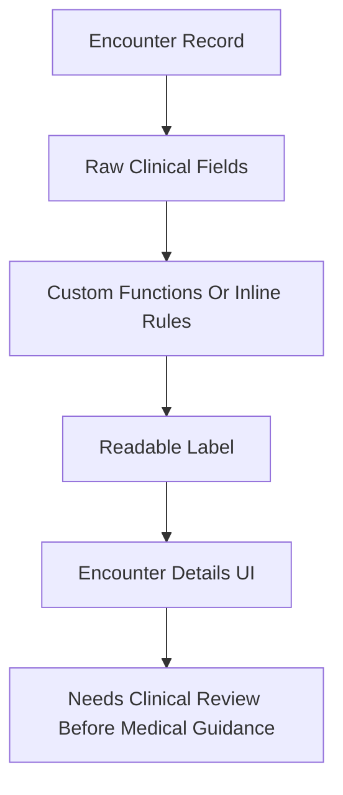

# Health Interpretation

## Current Status

The app includes basic rule-based health interpretation helpers and encounter-detail display logic. This is not a clinical decision support engine.

## Confirmed Interpretation Areas

| Area | Source | Output |
|---|---|---|
| Blood pressure | `bloodPressureConversion()` | `Severely High`, `Moderately High`, `Normal`, `Low`, `Out of Classification`, `Invalid Input`. |
| Hydration | `checkHydrationLevel()` | `Well hydrated`, `Fluid overload`, `Dehydrated`, invalid states. |
| pH | `checkpH()` | `Normal`, `Abnormal`, `Out of Range`, invalid states. |
| Pulse | `classifyPulse()` | `Normal`, `Distressed`, `Low`, `Unknown`. |
| UTI indicator | Inline logic in encounter details | `Yes`, `Potentital`, `No`. |
| Urine quality | Inline encounter details logic | `Good`, `Moderate`, `Poor`. |
| Bilirubin | Inline encounter details logic | `Good`, `Moderate`, `Poor`. |
| Gestational age | `calculateGestationalAgeInWeeks()` | Week number from LNMP. |
| Trimester | `calculateTrimester()` | Trimester 1, 2, or 3. |

## Inputs That Affect Interpretation

Confirmed:

- BP string in `encounters.bp`.
- Specific gravity string.
- pH string.
- Pulse integer.
- Urine fields such as nitrates, leucocytes esterase, casts, protein, clarity, bilirubin.
- LNMP date.

Not confirmed:

- Age input directly used in health interpretation.
- Chronic disease fields directly used in BP interpretation.
- Clinical risk scoring that combines multiple inputs.

## Age Handling

Mother date of birth exists on `mothers.date_of_birth`, and first encounter has `age_of_menarche`. I did not find BP or general health interpretation logic that calculates current age and changes recommendations based on that value.

Needs confirmation:

- Whether age should be added to BP interpretation.
- Whether current age should be derived from mother profile.
- Whether age-specific pregnancy thresholds are required.

## Chronic Disease Handling

First encounter records include chronic disease/history fields:

- Diabetes mellitus
- Hypertension
- Cardiac disease
- Asthma
- TB
- Epilepsy
- Sickle cell
- HIV status

These fields are confirmed in the schema/model, but they are not currently wired into the basic BP helper or a broader risk scoring engine.

## Clinical Disclaimer

The Rudo chat UI includes the message:

```text
Responses are stored in Supabase and are not a substitute for medical advice
```

The same spirit should apply to all rule-based health interpretations. These labels should be treated as UI summaries until clinically reviewed.

## Health Interpretation Flow



## Known Limitations

- Basic thresholds are hardcoded.
- Some labels contain typos, for example `Potentital`.
- BP logic may classify normal if either systolic or diastolic falls in the normal range, which needs clinical review.
- No unit tests cover interpretation helpers.
- No source clinical guideline is documented in the code comments.
- No age/chronic disease adjustment is confirmed.

## Recommended Improvements

- Move clinical interpretation rules into a dedicated service.
- Add tests for every threshold boundary.
- Add pregnancy-specific guideline references in code comments/docs after clinical review.
- Add a clinician-approved disclaimer and escalation guidance.
- Store interpretation version with saved results if results become persisted outside encounters.
