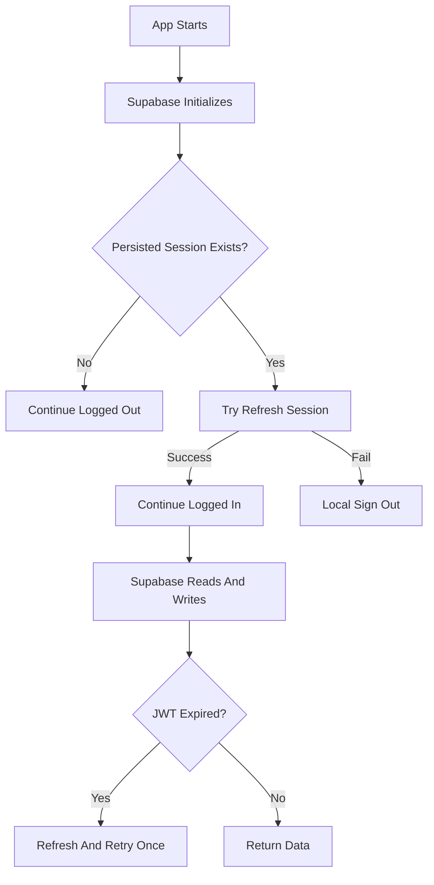

# Offline Mode

## Current Status

Offline mode is not confirmed as a complete feature in the current codebase.

I found local persistence for selected app state and Supabase session handling, but I did not find a full offline-first data model, local write queue, background sync, conflict handling, or offline login workflow.

## What Exists

| Area | Evidence | Status |
|---|---|---|
| Theme persistence | `lib/flutter_flow/flutter_flow_theme.dart` uses `SharedPreferences`. | Confirmed. |
| Mother reference persistence | `lib/app_state.dart` stores `ff_motherRef` in `SharedPreferences`. | Confirmed / Needs Review. |
| Supabase session persistence | `supabase_flutter` plus startup refresh in `supabase_config.dart`. | Confirmed. |
| Session refresh/retry | `SupabaseDatabase.runWithFreshSession()` refreshes near-expired sessions and retries expired JWT errors. | Confirmed. |
| Local database package | `sqflite` is in `pubspec.yaml`. | Dependency confirmed, active offline sync not confirmed. |

## What Offline Support Does Not Yet Confirm

- Offline login.
- Offline appointment booking.
- Offline mother profile updates.
- Offline period tracker writes with later sync.
- Offline Rudo chat.
- Local database caching of Supabase tables.
- Conflict resolution when internet returns.
- Connectivity detection.
- Retry queue.

## Current Session Behavior

The app tries to refresh a persisted Supabase session at startup. If the session cannot be refreshed, the code signs out locally. This protects the app from stale sessions, but it also means it should not be treated as offline login support.

## Offline Flow Diagram

## What Should Sync When Internet Returns

Needs confirmation. A future offline mode should define:

- Which tables can be cached.
- Which writes can be queued.
- Whether clinical data can ever be edited offline.
- How patient appointment conflicts are resolved.
- How Rudo chat behaves offline.
- How failed period tracker writes are retried.

## Recommended Future Implementation

- Add a connectivity service.
- Add a local store for safe patient-owned data only.
- Add a write queue for low-risk patient-owned writes, such as period tracker entries.
- Keep clinical encounter writes online-only unless there is a reviewed clinical workflow.
- Resolve `motherRef` from current auth user after login before using cached references.
- Add clear UI states for offline, syncing, failed sync, and stale data.
