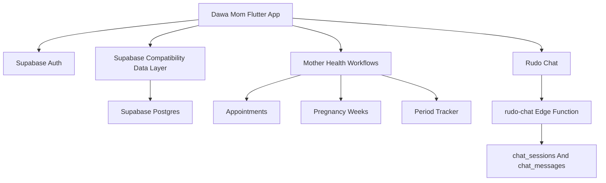
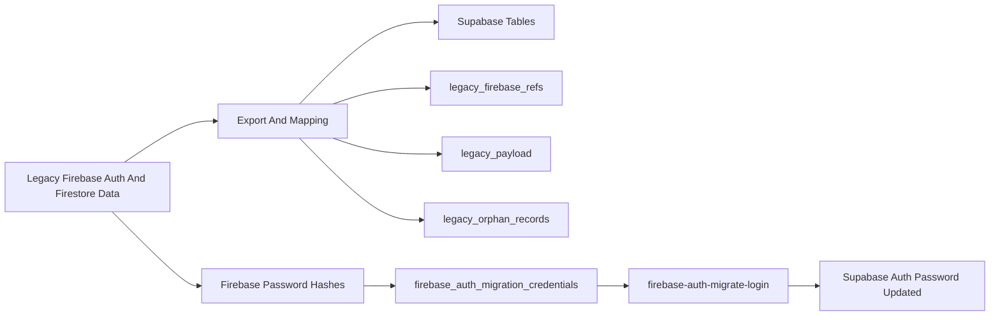
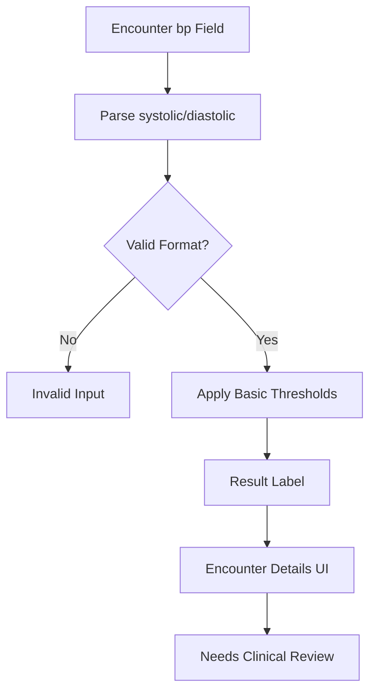
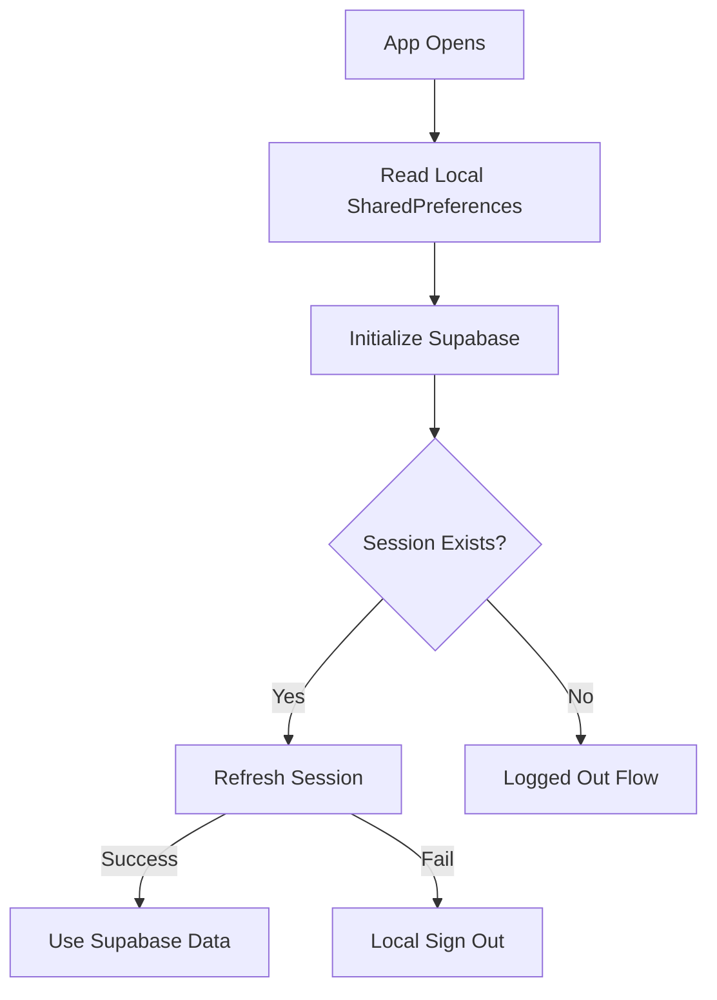
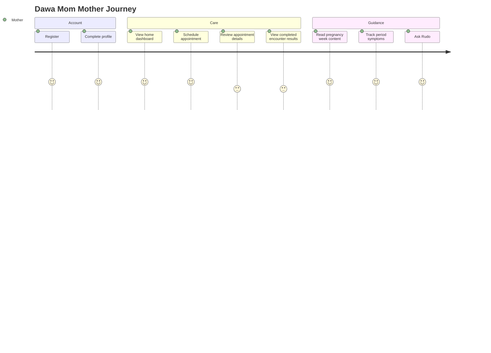

# Screenshots And Visuals

## Current Screenshot Status

No committed app screenshots were found in the repo.

I found app assets and illustrations under `assets/images/`, but I did not find actual captured screenshots of screens such as Login, Home, Appointment Details, Period Tracker, or Rudo chat. I am not adding fake screenshots.

## Existing Visual Assets

Confirmed assets include:

- Dawa logo and icon assets.
- Login/register illustrations.
- Pregnancy illustrations.
- Period/menstrual calendar illustration.
- No-data illustration.
- Doctor images.
- Splash/background media.

These are product assets, not screenshots.

## Screenshot Capture Checklist

Capture these before connecting the docs to a client-facing GitBook:

- [ ] Register screen.
- [ ] Login screen.
- [ ] Forgot password screen.
- [ ] Profile completion screen.
- [ ] Home/dashboard.
- [ ] Upcoming appointment card.
- [ ] No upcoming appointments state.
- [ ] Schedule appointment bottom sheet.
- [ ] Appointments list.
- [ ] Appointment details.
- [ ] Completed encounter results.
- [ ] Blood pressure result display.
- [ ] Pregnancy week detail.
- [ ] Period tracker overview.
- [ ] Period tracker settings.
- [ ] Period tracker daily symptoms/notes.
- [ ] Mother profile.
- [ ] Edit profile.
- [ ] Rudo chat modal.
- [ ] Rudo voice mode.
- [ ] Offline/error state if implemented later.

## Architecture Diagram



## Firebase To Supabase Migration Flow



## Blood Pressure Interpretation Flow



## Offline Mode Flow



## User Journey Flow



## Where Future Images Should Go

Place future captured screenshots here:

```text
docs/assets/screenshots/
```

Place exported static diagrams here only if Mermaid is not enough:

```text
docs/assets/diagrams/
```

Use relative image links from Markdown after the real files exist in `docs/assets/screenshots/`.
